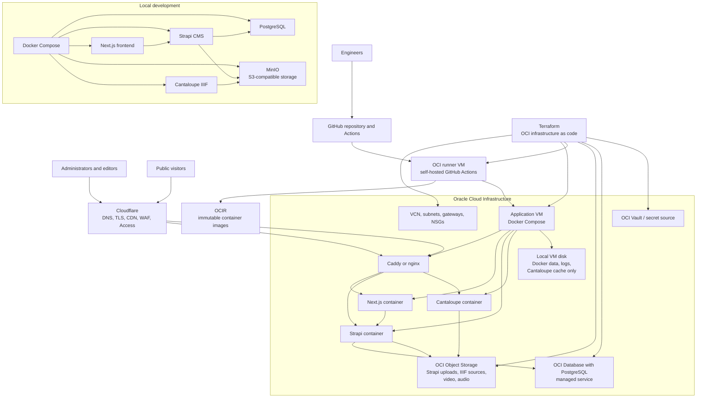

# Platform Overview

The AlMadar platform is designed so the website, CMS, media delivery system,
cloud infrastructure, deployment pipeline, and operating procedures can be
rebuilt from source control. This is deployment as code: instead of relying on
manual setup in cloud dashboards, the repository records how infrastructure is
created, how applications are packaged, how secrets are delivered, and how the
production environment should be deployed.

For non-technical administrators, this means the platform is documented as a
repeatable operating system for the organization. The public website presents
collection content to visitors. Strapi gives staff an administrative interface
for managing editorial and collection data. Cantaloupe delivers IIIF images from
object storage. OCI Database with PostgreSQL stores CMS data. OCI Object Storage
stores Strapi uploads, IIIF source images, video, and audio. Cloudflare provides
the public DNS, TLS, CDN, and security edge.

For the August 1, 2026 production launch, Oracle Cloud Infrastructure hosts:

- one application VM running Docker Compose,
- one separate self-hosted GitHub Actions runner VM,
- managed PostgreSQL,
- Object Storage,
- Vault or equivalent secret source-of-truth configuration.

Kubernetes/OKE, Helm, External Secrets Operator, and Actions Runner Controller
are deferred from the launch architecture.

## Current Infrastructure Chart

## Guide For Administrators

The platform has four main user-facing responsibilities:

- The public website is the visitor-facing experience for browsing and
  discovering AlMadar content.
- The CMS is the staff-facing administration area for editorial content,
  metadata, and media management.
- The image service delivers high-resolution IIIF images without storing files
  inside application containers.
- The cloud edge protects and accelerates the public services with DNS, HTTPS,
  caching, and security controls.

The repository is the source of truth for how these responsibilities are
implemented. When the team changes infrastructure, deployment behavior, or
operating procedures, the change should be reflected here. This reduces the risk
that knowledge exists only in one engineer's memory or in a cloud dashboard
that future staff cannot reconstruct.

For launch, production should stay intentionally small: one app VM, one runner
VM, managed PostgreSQL, Object Storage, and Cloudflare. The local development
environment mirrors the same application shape with Docker Compose, replacing
managed PostgreSQL and Object Storage with local PostgreSQL and MinIO.

## Technical Overview For IT Professionals

The platform is built around stateless application containers and managed data
services. Next.js, Strapi, and Cantaloupe run as containers on a Docker Compose
application VM. Production PostgreSQL data lives in OCI Database with
PostgreSQL, Oracle's managed PostgreSQL service, rather than on the VM. Media
and source assets live in OCI Object Storage buckets. Application containers and
the app VM should be replaceable without losing durable data.

Terraform under `infrastructure/terraform/` defines or should define the OCI
foundation:

- `network` creates the VCN, subnets, gateways, route tables, and NSGs.
- `object-storage` creates S3-compatible buckets for Strapi media, IIIF images,
  video, and audio.
- `managed-postgresql` creates OCI Database with PostgreSQL resources.
- `compute-vm` should create the application VM and runner VM.
- `vault-secrets` creates Vault/KMS resources and secret payloads if Vault is
  used as the secret source of truth.

Deployment assets should live under `deploy/`:

- `deploy/compose` defines the production Docker Compose runtime, proxy config,
  systemd service, and deployment scripts.
- `deploy/runner` defines the self-hosted GitHub Actions runner VM setup.

Secrets are not stored in committed environment files. Production Compose should
receive secrets through a documented deployment process, backed by OCI Vault,
GitHub environment secrets, or runner-local secret material with rotation
procedures.

Cloudflare fronts the public services and should point to the application VM
proxy origin. Its responsibilities are DNS, TLS, CDN caching, WAF protections,
and administrative access controls. Cloudflare behavior is documented in
`docs/cloudflare.md`; OCI and this repository remain the infrastructure source
of truth.

The local development environment mirrors production concepts with lower-cost
substitutes. Docker Compose runs Next.js, Strapi, PostgreSQL, MinIO, and
Cantaloupe. MinIO provides the same S3-compatible API shape used by OCI Object
Storage, so application behavior is environment-driven rather than changed in
code between local and production environments.
