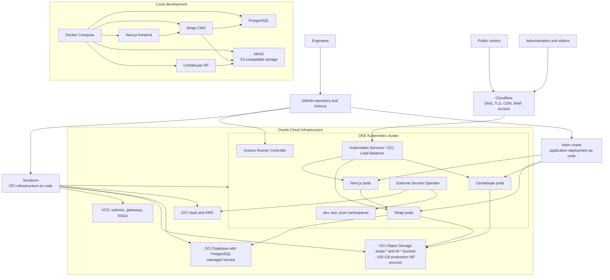

# Platform Overview

The AlMadar platform is designed so the website, CMS, image delivery system,
cloud infrastructure, deployment pipeline, and operating procedures can be
rebuilt from source control. This is deployment as code: instead of relying on
manual setup in cloud dashboards, the repository records how infrastructure is
created, how applications are packaged, how secrets are delivered, and how each
environment should be deployed.

For non-technical administrators, this means the platform is documented as a
repeatable operating system for the organization. The public website presents
collection content to visitors. Strapi gives staff an administrative interface
for managing editorial and collection data. Cantaloupe delivers approximately
100 GB of high-resolution production IIIF source images from object storage.
OCI Database with PostgreSQL, Oracle's managed PostgreSQL service, stores CMS
data. Cloudflare provides the public DNS, TLS, CDN, and security edge. Oracle
Cloud Infrastructure hosts the production Kubernetes cluster, managed database,
object storage, and secret vault.

The same general architecture is used locally and in production. Developers run
PostgreSQL, MinIO, Strapi, Next.js, and Cantaloupe with Docker Compose. In
production, Terraform provisions OCI resources, Helm deploys applications to
Kubernetes, External Secrets Operator copies approved secrets from OCI Vault
into the cluster, and GitHub Actions builds and deploys application changes.

## Current Infrastructure Chart

## Guide for Administrators

The platform has four main user-facing responsibilities:

- The public website is the visitor-facing experience for browsing and
  discovering AlMadar content.
- The CMS is the staff-facing administration area for editorial content,
  metadata, and media management.
- The image service delivers high-resolution IIIF images without storing files
  inside application containers.
- The cloud edge protects and accelerates the public services with DNS, HTTPS,
  caching, and security controls.

The repository is the source of truth for how these responsibilities are
implemented. When the team changes infrastructure, deployment behavior, or
operating procedures, the change should be reflected here. This reduces the risk
that knowledge exists only in one engineer's memory or in a cloud dashboard that
future staff cannot reconstruct.

The production platform is organized into `dev`, `test`, and `prod`
environments. These environments share one Kubernetes cluster for cost control,
but they are separated by namespaces, configuration values, secrets, and release
workflow. Promotion should follow the branch strategy documented in this
repository: `develop` for development, `release/*` for test, and `main` for
production.

## Technical Overview for IT Professionals

The platform is built around stateless application containers and managed data
services. Next.js, Strapi, and Cantaloupe run as Kubernetes workloads in OKE.
Production PostgreSQL data lives in OCI Database with PostgreSQL, Oracle's
managed PostgreSQL service, rather than in Kubernetes or on self-managed
compute. Media and approximately 100 GB of production IIIF source images live
in OCI Object Storage buckets. Application pods should be replaceable at any
time without losing durable data.

Terraform under `infrastructure/terraform/` defines the OCI foundation:

- `network` creates the VCN, subnets, gateways, route tables, and NSGs.
- `object-storage` creates S3-compatible buckets for Strapi media and IIIF
  images.
- `postgresql` creates OCI Database with PostgreSQL managed DB systems through
  the `managed-postgresql` Terraform module.
- `oke` creates the single OKE cluster and managed node pool.
- `oke-rbac` creates Kubernetes namespaces and access boundaries.
- `vault` creates Vault/KMS resources and secret payloads.

Helm charts under `infrastructure/helm/` define the deployable applications:

- `frontend` deploys the Next.js public website.
- `strapi` deploys the CMS and its migration job.
- `cantaloupe` deploys the IIIF image server.
- `actions-runner-controller` values support self-hosted GitHub Actions runners
  inside OKE.

Secrets are not stored in Helm values files or committed environment files.
OCI Vault stores the approved secret payloads. External Secrets Operator reads
from Vault and creates the `almadar-secrets` Kubernetes Secret in the `dev`,
`test`, and `prod` namespaces. The same pattern is used for GitHub App
credentials needed by Actions Runner Controller.

Cloudflare fronts the public services and should point to OCI load balancer
origins rather than directly to pods or worker nodes. Its responsibilities are
DNS, TLS, CDN caching, WAF protections, and administrative access controls.
Cloudflare behavior is documented in `docs/cloudflare.md`; OCI and Kubernetes
remain the infrastructure source of truth.

The local development environment mirrors production concepts with lower-cost
substitutes. Docker Compose runs Next.js, Strapi, PostgreSQL, MinIO, and
Cantaloupe. MinIO provides the same S3-compatible API shape used by OCI Object
Storage, so application behavior is environment-driven rather than changed in
code between local and production environments.
